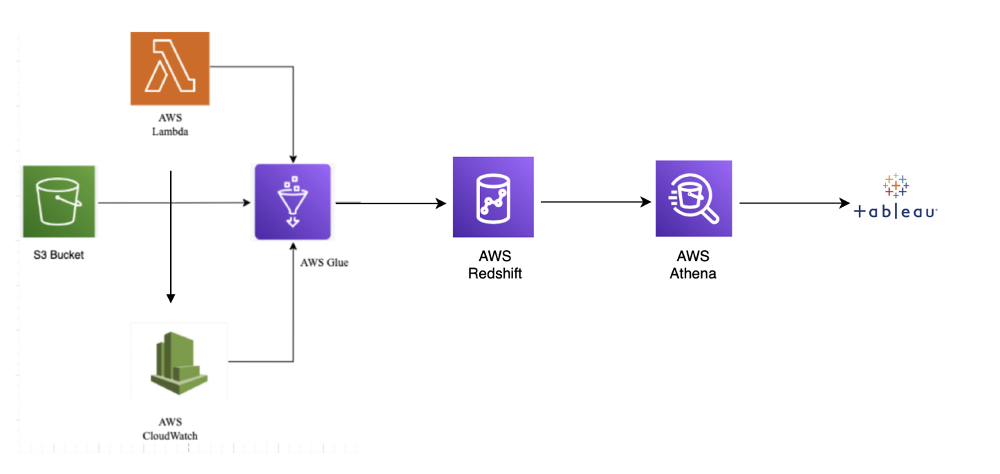
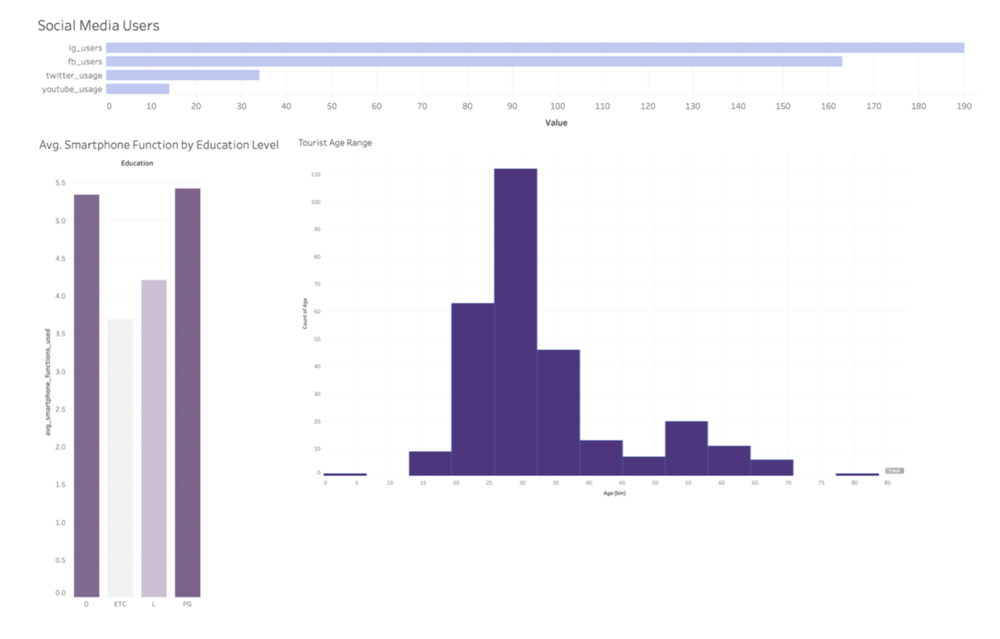
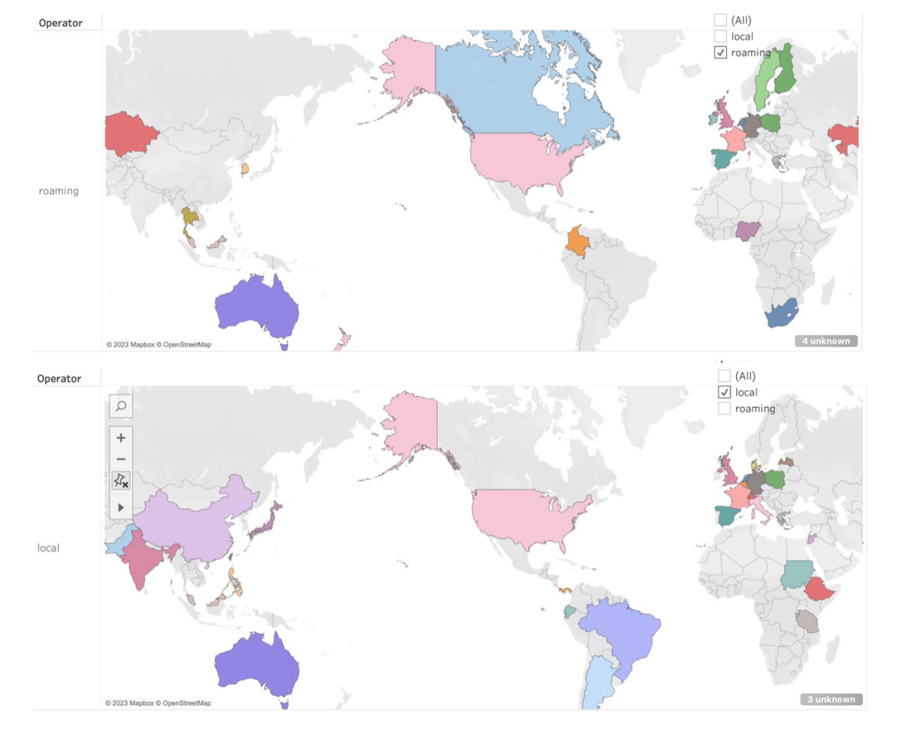

# Setting
Smartphones are undeniably an integral part of everyone’s daily life, with additional capabilities being added to them frequently their importance in our lives only solidifies further. It is crucial to analyze their influence in all sectors of business so as understand how it can used to their advantage. The analysis for the purpose of this project will be centered around how smartphone usage affects the tourism industry, specifically how they affect the behavior of international tourists. Usage can be grouped into several forms such as social media, internet access, mobile operator used, etc. The goal of the analysis is the understand the extent of impact that smartphone usage has on tourists. 

# Problem Definition
The raw data provides information about how tourists behave during the trip with respect to internet and smartphone feature usage as well as their behavior during the planning of the trip, specifically in relation to Trip Advisor reviews that may impact their decision. Dimensions derived from the data include: 

• stat (stat_id, operator, number_of_smartphone_functions, number_of_locations, purpose)
• social_media (scomed_id, fb_usage, ig_usage, twitter_usage, youtube_usage)
• person (person_id, age, gender, education, country, stat_id, scomed_id)
• hotel (hotel_id, name, no_of_ratings, rating)
• place (place_id, tourist_attraction, type, no_of_ratings, rating)
• behavior (person_id, hotel_id, place_id, internet_daily_usage, ratings_per_review_hotel, ratings_per_review_place)
It is known that tourism can have a momentous effect on a country’s economy and gaining insight into how it this be leveraged using smartphones as well as provide the tourist an enjoyable experience is ultimately a mutually beneficial endeavor. 
The goal is to analyze the relationship between smartphone usage and international tourist behavior in the city of Bandung, Indonesia, and to understand the extent of the impact that smartphone usage has on tourists. This will be achieved by analyzing the questionnaire data and Trip Advisor data to gain insights into how tourists use their smartphones during their trip, how they use social media, how they plan their trip using online resources, and how they rate hotels and tourist attractions. 

# Architecture Diagram

# Dashboards

# Results 
 
1. Local operators vs. roaming: Tourists from India and the US are more likely to use local operators instead of roaming, while tourists from Australia and Canada are more likely to use roaming. This suggests that tourists from different regions may have different preferences and needs when it comes to mobile network services. Businesses in the telecommunications industry could use this information to tailor their services to better suit the needs of different tourist groups.
   
2. Tourist demographic: The majority of tourists are in their 30s and have a diploma, and they use social media platforms like Facebook and Twitter to share details of their trip. This information can be helpful for businesses that cater to tourists, such as hotels, restaurants, and tour operators, to target their marketing and advertising efforts towards this demographic.
   
3. Top places and hotels: The top places and hotels have been calculated based on both the number of ratings and the highest reviews. This information can be useful for tourists who are looking for popular and highly rated places to visit or stay, as well as for businesses that want to improve their ratings and reviews by providing quality services and experiences to their customers.
   
4. Internet usage: The average hours of internet usage by places visited shows that internet usage is lowest in places like religious sites and highest in places like shopping malls. This information can be helpful for businesses that offer free Wi-Fi or other internet-related services, as they can target their efforts towards places where internet usage is higher. Additionally, it suggests that tourists may have different needs and preferences when it comes to internet access depending on the places they visit.
